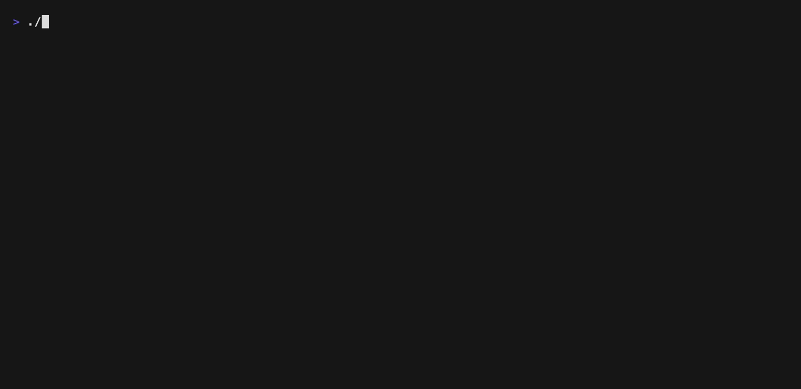
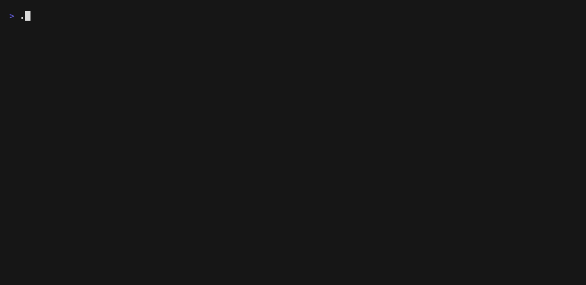
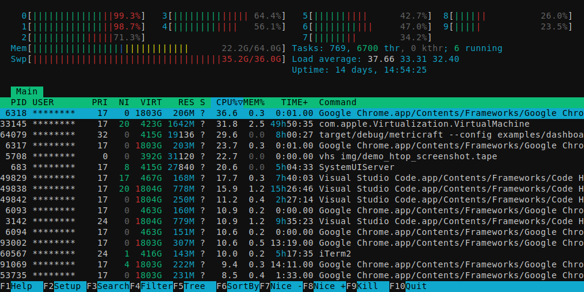

twrap
===

A TUI wrapper for applying rules to live terminal screens.

## About

`twrap` launches an interactive terminal application as a child process and wraps its screen with extra behavior from the outside.
It is designed for practical live-screen automation such as highlighting matches, masking sensitive text, taking screenshots, and remapping keys without modifying the target TUI itself.

## Install

```bash
cargo install twrap
```

## Example

### Use vim & less



This demo wraps both `vim` and `less` with the same live screen rules.
`twrap` highlights `ERROR` lines and rewrites `user=...` to `user=hidden` on screen, so the sensitive value is hidden in the TUI while the original file content stays unchanged.

### Use htop



This demo wraps `htop` with live masking and a custom screenshot key.
`twrap` masking `blacknon` to `*` on screen, remaps `s` to the screenshot action, and saves the captured SVG under `./tmp/twrap-artifacts/` with the configured `htop-demo-...` prefix.

#### Screenshot



## Usage

Use `twrap` by placing its options before the target TUI command.
You can still add `--` when you want to make the command boundary explicit.
You can combine highlighting, screenshots, masking, replacement, and key remapping in a single run.

### Command

```bash
twrap [options] <command> [args...]
```

```text
$ twrap --help
Wrap an existing TUI and add highlights plus screenshots

Usage: twrap [OPTIONS] <COMMAND>...

Arguments:
  <COMMAND>...

Options:
  -e, --highlight <HIGHLIGHT>
  -H, --highlight-color <HIGHLIGHT_COLOR>        [default: #fff59d]
  -x, --highlight-command <HIGHLIGHT_COMMAND>
  -S, --highlight-capture-tui-screenshot
  -o, --screenshot-dir <SCREENSHOT_DIR>          [default: tmp/twrap-artifacts]
  -p, --screenshot-prefix <SCREENSHOT_PREFIX>
  -k, --screenshot-key <SCREENSHOT_KEY>          [default: ctrl-g]
  -b, --bind <BIND>
  -R, --replace <PATTERN> <TEXT>
  -M, --mask <MASK>
  -c, --mask-char <MASK_CHAR>                    [default: *]
  -C, --startup-capture-ms <STARTUP_CAPTURE_MS>  [default: 0]
  -h, --help                                     Print help
  -V, --version                                  Print version
```

### Set keybind

Remap keys before they reach the wrapped TUI with `--bind FROM=TO`.
This is useful for shortcut aliases or assigning actions such as screenshots.

`TO` supports `screenshot`, key names like `up`, `down`, `enter`, `f1`, `ctrl-c`, or `text:...`.

Example:

```bash
twrap -b j=down -b k=up -b ctrl-p=screenshot lazygit
```

### Get screenshot

Save screenshots from the wrapped screen with `--screenshot-key`, `--screenshot-dir`, and `--screenshot-prefix`.
Enable `-S` if you also want screenshots captured when a highlight command matches.
Screenshots are saved as SVG files.

Prefix templates support `{key}`, `{backend}`, `{capture_kind}`, `{ext}`, `{timestamp}`, and `{env:NAME}`.

Example:

```bash
twrap -p 'nightly-{capture_kind}-{timestamp}-' -k ctrl-t btop
```

### Hilight keyword, auto execute command, and get auto screenshot

Highlight matching text with `--highlight PATTERN`.
Add `--highlight-command '...'` to run a command when a match appears, and add `-S` to save a screenshot at the same time.
The command receives event data through environment variables such as `TWRAP_HIGHLIGHT_KEY`, `TWRAP_HIGHLIGHT_PATTERN`, `TWRAP_HIGHLIGHT_MATCHES_JSON`, and `TWRAP_HIGHLIGHT_EVENT_JSON`.
You can also interpolate `{backend}`, `{key}`, `{pattern}`, `{matches_json}`, `{event_json}`, and `{capture_path}` anywhere in the command arguments.
When `-S` is enabled, `TWRAP_HIGHLIGHT_CAPTURE_PATH` is also set to the saved screenshot path.

Example:

```bash
twrap -e '(?i)error' -x 'notify-send "twrap: {key}" "{matches_json}"' -S htop
```

### Masking

Hide sensitive text on screen with `--mask PATTERN`.
Each matched character is replaced with the configured mask character.

`--mask-char` changes the masking character.

Example:

```bash
twrap -M 'token=[^ ]+' htop
```

### Replace keyword

Rewrite matched text on screen with `--replace PATTERN TEXT`.
This is useful when you want a stable visible label instead of the original text.

Replacement is fitted to the matched display width, truncating or padding with spaces when needed.

Example:

```bash
twrap -R 'user=[^ ]+' 'user=hidden' htop
```

## Related Projects

- [baeru](https://github.com/blacknon/baeru): an earlier TUI wrapper project based on the same core idea.

## License

MIT. See [LICENSE](LICENSE).
